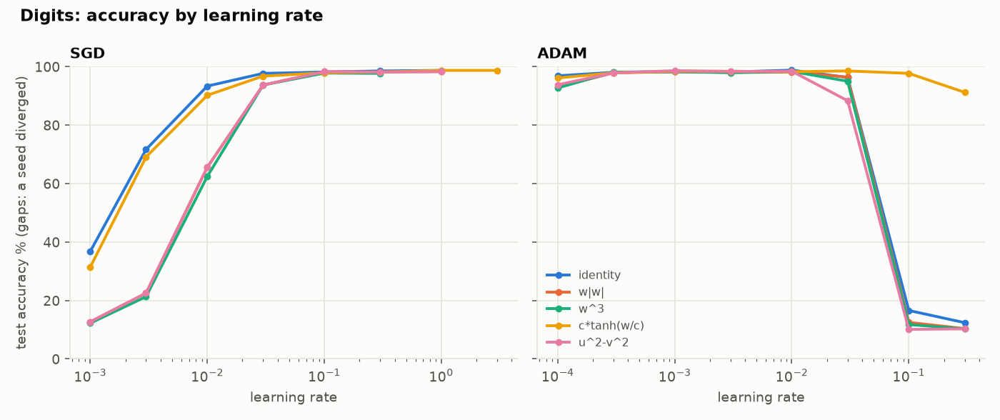
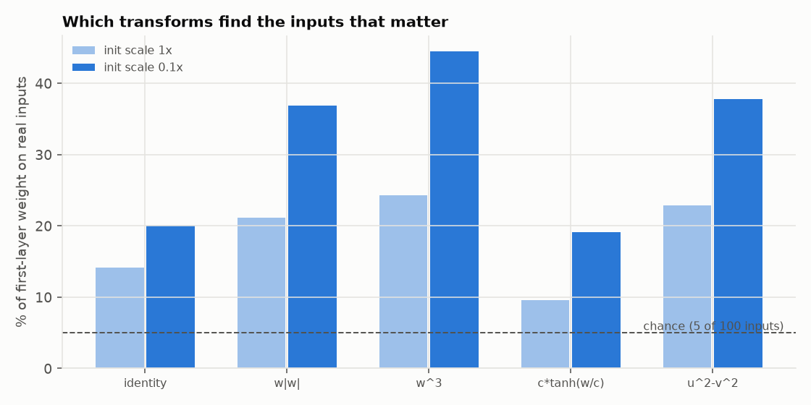
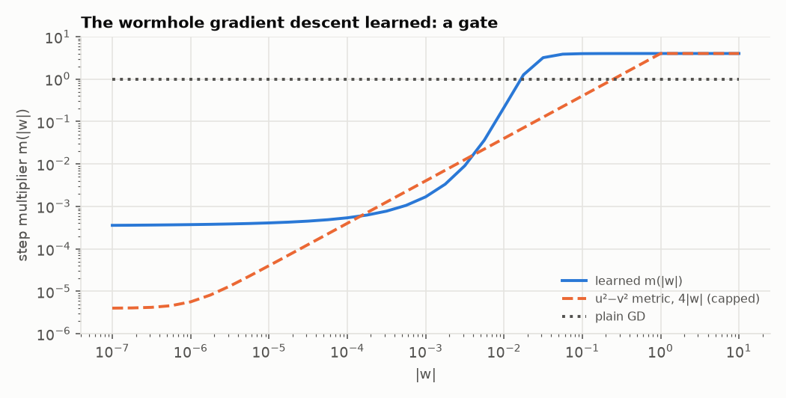

# styx

### Charon's weight transforms, taken into neural networks.

[](https://github.com/EgorKhaklin/styx/actions/workflows/tests.yml)
[](LICENSE)

[charon](https://github.com/EgorKhaklin/charon) asked what a transform `W = T(raw)` does to
gradient descent on linear regression. The answer was a learning rate that depends on position,
plus a range: the route changes, the destination doesn't, except when many answers fit.
styx is the river Charon crosses. It runs the same transforms through real networks.

Every `nn.Linear` weight goes through `T` with torch's own
[`parametrize`](https://pytorch.org/docs/stable/generated/torch.nn.utils.parametrize.register_parametrization.html).
Each transform has an exact inverse, so the transformed network **starts as the same network**
(tested): the only difference is how the optimizer moves.

| transform | T | what it does to a step |
|---|---|---|
| identity | `w` | the baseline |
| w\|w\| | `w·|w|` | step scales with \|w\|: small weights barely move |
| w³ | `w³` | step scales with w²: even stronger rich-get-richer |
| c·tanh(w/c) | `0.2·tanh(w/0.2)` | every weight bounded by 0.2 |
| u²−v² | `u² − v²`, two tensors | the squared factorization charon's E6 used |

## Results

Every number comes from `python -m styx.experiments` (about 3 minutes on a laptop CPU; full
output in [results/run.txt](results/run.txt)).

**N1. When data is plentiful, no transform helps.** On sklearn's 8×8 digits, a 64-128-128-10
network with a tuned learning rate reaches about 98.5% test accuracy whatever the transform:

| optimizer | transform | best lr | test accuracy % | lrs reaching 95% |
|---|---|---|---|---|
| SGD | identity | 1 | 98.7 ± 0.3 | 0.03 to 1 |
| SGD | w\|w\| | 1 | 98.3 ± 0.2 | 0.1 to 1 |
| SGD | w³ | 0.1 | 97.8 ± 0.4 | 0.1 to 0.3 |
| SGD | c·tanh(w/c) | 1 | 98.7 ± 0.5 | 0.03 to 3 |
| SGD | u²−v² | 1 | 98.2 ± 0.1 | 0.1 to 1 |
| Adam | identity | 0.01 | 98.8 ± 0.3 | 0.0001 to 0.03 |
| Adam | w\|w\| | 0.001 | 98.2 ± 0.1 | 0.0003 to 0.03 |
| Adam | w³ | 0.01 | 98.3 ± 0.2 | 0.0003 to 0.03 |
| Adam | c·tanh(w/c) | 0.03 | 98.5 ± 0.5 | 0.0001 to 0.1 |
| Adam | u²−v² | 0.001 | 98.6 ± 0.4 | 0.0003 to 0.01 |

The one difference is robustness. The bounded `tanh` weights never diverged and kept working
at learning rates where every other network failed (91% under Adam at lr 0.3, against about 10%
for the rest). Charon's prediction carries over: the power transforms need larger learning rates
under SGD, because their steps shrink with the weights.



**N2. When data is scarce and most inputs are noise, the power transforms win.** 200 training
examples, 100 inputs, labels from a small random network that reads only 5 of them. A
100-64-1 network under Adam, learning rate picked on a separate validation set, scored on 2000
test examples, repeated over 10 independent tasks:

| init scale | transform | test accuracy % | vs identity, same task | first-layer weight on the 5 real inputs |
|---|---|---|---|---|
| 1x | identity | 69.0 ± 4.4 | baseline | 14% |
| 1x | w\|w\| | 72.0 ± 5.2 | +3.0 (better on 10/10) | 21% |
| 1x | w³ | 73.2 ± 5.3 | +4.2 (better on 10/10) | 24% |
| 1x | c·tanh(w/c) | 65.8 ± 3.5 | −3.2 (better on 0/10) | 10% |
| 1x | u²−v² | 72.0 ± 5.2 | +3.0 (better on 10/10) | 23% |
| 0.1x | identity | 69.6 ± 4.9 | baseline | 20% |
| 0.1x | w\|w\| | 74.3 ± 5.2 | +4.7 (better on 10/10) | 37% |
| 0.1x | w³ | 76.1 ± 5.6 | +6.5 (better on 10/10) | 44% |
| 0.1x | c·tanh(w/c) | 66.4 ± 3.8 | −3.2 (better on 0/10) | 19% |
| 0.1x | u²−v² | 73.8 ± 5.5 | +4.2 (better on 10/10) | 38% |

Chance for the weight share is 5%. The transforms whose step shrinks with the weight
(`w|w|`, `w³`, `u²−v²`) put more of the first layer on the inputs that matter, and they beat
the plain network on every one of the 10 tasks. Starting smaller strengthens the effect, as it
did in charon. The bounded `tanh` network is worse on every task: a cap on weights is not a
preference for few of them.



## Learned wormholes

charon showed that a transform is a metric. Gradient descent on `θ` moves the effective weight by
`−lr · m(W) · dL/dW`, with `m(W) = T'(T⁻¹(W))²`. So instead of guessing `T`, styx lets gradient
descent learn `m`. [styx/wormholes.py](styx/wormholes.py) makes `m` a small network of `log|W|`
and fits it by differentiating through whole training runs. The only signal is the error on
held-out equations after 400 steps. The learner never sees the true weights. Every number
below comes from `python -m styx.frontier` (output in [results/frontier.txt](results/frontier.txt)
and [results/frontier_w4.txt](results/frontier_w4.txt)).

**W1. It learns a gate, and the gate beats the hand-made transforms.** On charon's sparse problem
(40 equations, 200 unknowns), 100 new test problems, the same 400-step budget, and baselines
tuned on 24 other problems:

| nonzeros | method | median error vs true w | exact recoveries |
|---|---|---|---|
| 5 | plain gradient descent | 0.893 | 0% |
| 5 | `u²−v²` metric, tuned | 0.111 | 0% |
| 5 | **learned wormhole** | **0.018** | 18% |
| 5 | L1 minimization (linear program) | 0.000 | 100% |
| 8 | `u²−v²` metric, tuned | 0.436 | 0% |
| 8 | learned wormhole | 0.261 | 0% |
| 8 | L1 minimization | 0.000 | 85% |



The learned `m` has a small floor, then rises like `W²` (twice the slope of `u²−v²`), then
saturates at the step cap. A weight stays nearly frozen until the gradient has pushed it past
about 0.01, then it moves at full speed. A second training with a different network, where `m`
could also depend on training time, found the same shape, gating a little tighter as training
went on. It was no better (median 0.018 on the same test problems).

**W4. The gate as a formula beats the network that found it.** Fitting the curve's shape gives

```
m(W) = f·|W|^q + 4·W² / (W² + τ²)
```

Without the floor term, `1/m = (1 + τ²/W²)/4`. The implied mirror potential is
`W²/8 − (τ²/4)·log|W|`: a log barrier, the shape of the log-sum sparsity penalty. The floor
lets weights leave zero. Three parameters, picked on 24 other problems:

| nonzeros | method | median error | exact recoveries |
|---|---|---|---|
| 5 | log wormhole, 400 steps | 0.0018 | 65% |
| 5 | log wormhole, 3000 steps | 0.0000 | 99% |
| 5 | L1 minimization | 0.0000 | 100% |
| 8 | log wormhole, 3000 steps | 0.0002 | 69% |
| 8 | L1 minimization | 0.0000 | 85% |
| 11 | log wormhole, 3000 steps | 0.692 | 5% |
| 11 | L1 minimization | 0.694 | 22% |
| 11 | reweighted L1 | 0.680 | 22% |

Plain gradient descent with this one elementwise metric matches L1 minimization on easy
problems. As the problems get harder, it falls behind (69% against 85% exact, then 5%
against 22%). Beating L1 past its failure point was the hope, and it did not happen. Neither
did the known route to it: on the same test problems, reweighted L1 (Candès, Wakin and Boyd,
5 reweights) recovers exactly what L1 does (85% at 8 nonzeros, 22% at 11). At this size L1
looks close to the ceiling. In side runs (not in the script), shrinking `τ` during training made
the log wormhole worse (45% exact at 8 nonzeros), and retraining the learned `m` at 12 nonzeros did not converge in 250
meta-steps.

**W2. In a network.** N2's task (200 examples, 5 of 100 inputs matter, 10 tasks), plain SGD,
the metric applied to the first layer only, with learning rate, metric scale and init picked
on validation:

| first-layer step | test accuracy % | vs plain SGD, same task | first-layer weight on the 5 real inputs |
|---|---|---|---|
| plain SGD | 72.5 ± 5.0 | baseline | 34% |
| `u²−v²` metric, `4|W|/s` | **79.8 ± 4.7** | +7.3 (better on 10/10) | 72% |
| learned wormhole, `m(|W|/s)` | 75.8 ± 4.7 | +3.4 (better on 10/10) | 43% |

Both help on every task, and under plain SGD the gain is larger than N2's under Adam. The gate
learned on linear problems transfers only partly: the simple `u²−v²` metric wins in the network. W4's log
wormhole, tried in a side run with the same tuning, ties it: 79.3 ± 5.4, better than plain SGD on
10/10 tasks and better than `u²−v²` on 4/10.

**W3. Grid walls (mixed).** `T(t) = D·(t − (1−ε)·sin(2πt)/(2π))` makes `T'` fall to `ε·D` at
every multiple of `D`, so weights slow down at the grid and stay inside their starting cell.
On digits (Adam, 3 seeds), rounded to a coarse grid after training:

| grid step | plain, then rounded | STE (quantization-aware) | walls, ε = 0.03 |
|---|---|---|---|
| 0.2 | 98.5% | **98.7%** | 97.2% |
| 0.35 | 88.3% (worst seed 79.7%) | 7.5% (collapsed) | **93.1%** (worst 91.9%) |

At the coarse grid the walls hold up where plain rounding loses 10 points. The simple STE
collapses there, because every starting weight rounds to zero. A properly tuned
quantization-aware method would likely do better than both, so this is not a quantization
result.

**Also tried, did not work.** Wormhole jumps (charon E10). Nested `tanh`/`sinh` around a power
(charon E9).

## What is and isn't new here

The N2 effect is a known one. Powerpropagation (Schwarz et al., NeurIPS 2021) uses the
`w|w|^(α−1)` family for sparse networks, and the `u²−v²` bias toward sparse solutions is
established theory for linear models. styx reproduces it in a small, fully tested setting
and compares the family side by side. It does not claim a new method.

The learned wormholes are closer to new. Learned mirror maps exist (Tan et al., "Data-Driven
Mirror Descent with Input-Convex Neural Networks", 2023), but they are learned for speed on
inverse problems. A literature search found no work that meta-learns an elementwise
reparameterization, that is, an implicit bias, for the quality of the answer, or that
distills it to a log-barrier metric. The comparison that matters is L1 and reweighted-L1
(Candès, Wakin and Boyd, 2008), and on it the result is a tie on easy problems and a loss on
hard ones.

## Run it

```bash
python -m venv .venv && .venv/bin/pip install -e '.[test]'
.venv/bin/python -m pytest -q              # 21 tests
.venv/bin/python -m styx.experiments       # ~3 min; writes figures/ and results/
.venv/bin/python -m styx.frontier w1 w2 w3 > results/frontier.txt     # ~30 min
.venv/bin/python -m styx.frontier w4 > results/frontier_w4.txt        # ~10 min
```

The tests check that registration keeps the initial network exactly, that autograd's gradient
on the raw parameters matches a finite difference for every transform, and that `T = c²·w` is
plain training at learning rate ×c⁴ under SGD and ×c² under Adam (charon's E5 and E7, now in
torch, exact to float64).

## Limits

Small networks, small datasets, CPU only. N1 uses 3 seeds and N2 uses 10 synthetic tasks. The
N2 margins are consistent across tasks but come from one synthetic task family. Nothing here is
a claim about large models or real data.

## License

MIT
